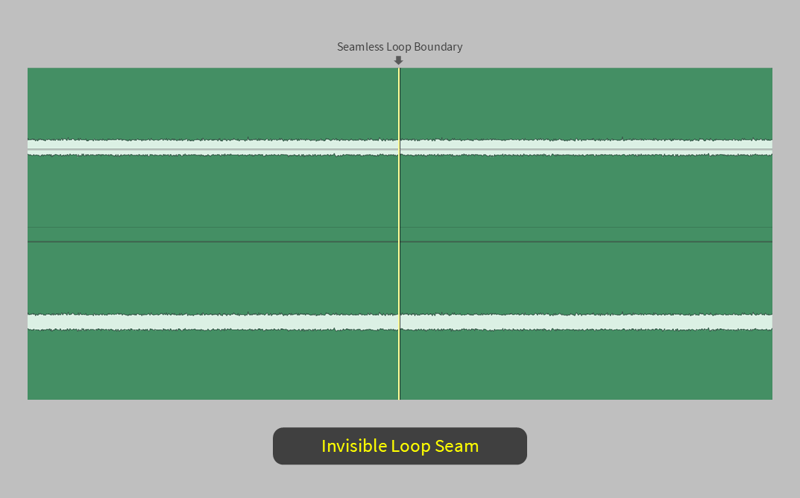
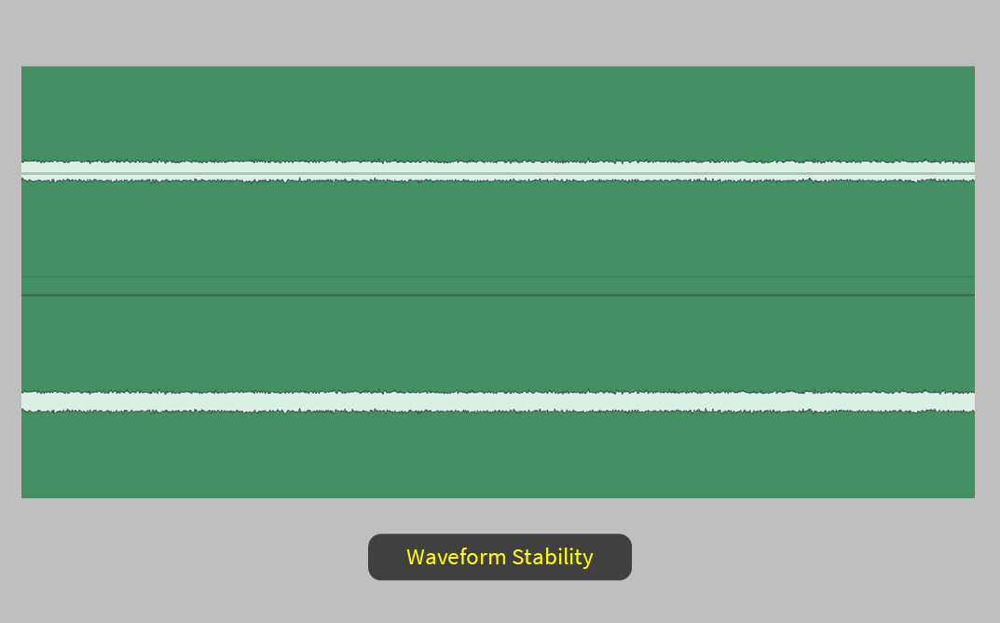
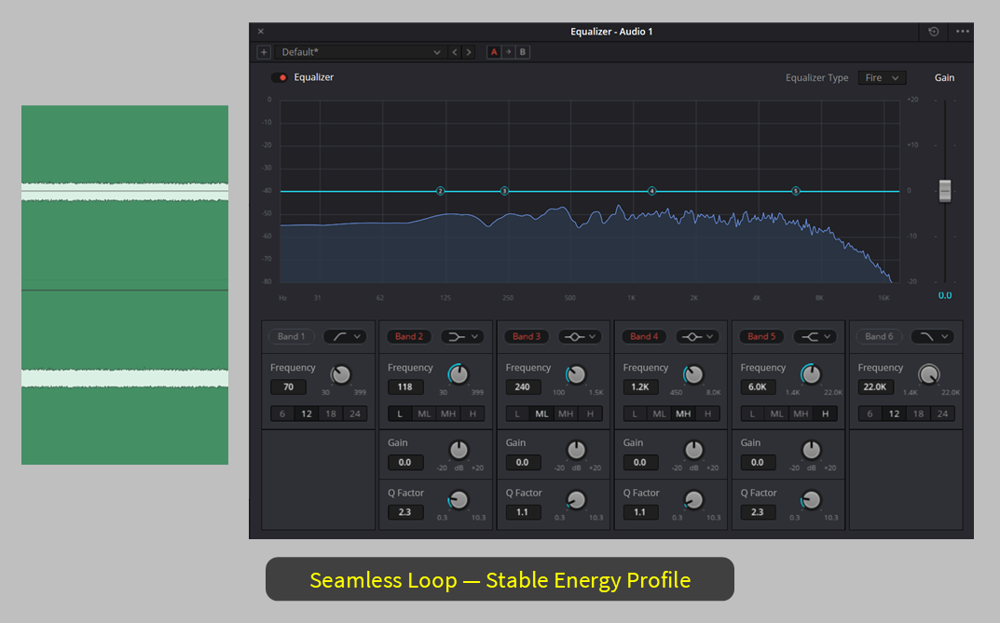
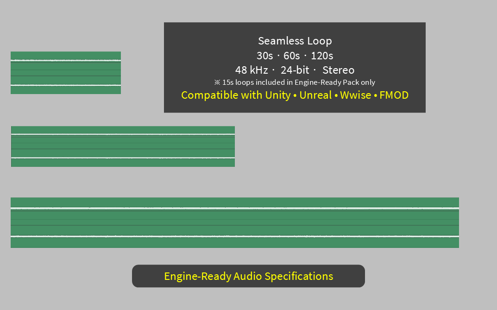

# Game Audio Ambience Engineering Guide

Poorly designed ambience loops can produce clicks, repetition artifacts, and dialogue masking in games.

This repository explains common technical issues developers encounter when designing ambience loops for real-time game engines.

It focuses on practical problems that arise when ambience loops are used in interactive environments such as Unity and Unreal Engine.

An example audio file containing three engine-ready ambience excerpts is available for evaluation download so developers can test it directly in real-time audio systems.

*Example of a seamless loop boundary with no discontinuity*

---

## Purpose

The goal of this guide is to explain common technical issues in ambience loop design and provide practical insights for creating stable ambience in real-time audio systems.

This guide focuses on engineering principles rather than specific audio tools or plugins.

*Stable amplitude profile suitable for long-duration playback*

---

## Target Environments

- Unity
- Unreal Engine
- FMOD
- Wwise

---

## Documentation

*Representative spectral profile of ambience signal*

## Free Evaluation Sample

A free evaluation sample containing short engine-ready ambience excerpts is available for testing in real-time audio systems.

➡️ **Free evaluation sample download:**  
https://chemitree.gumroad.com/l/vjzbux

---

This guide covers common technical problems encountered when designing ambience loops for game audio systems.

The articles focus on common runtime problems such as:

- loop discontinuity
- spectral masking
- repetition perception
- runtime loop stability

- [Why Ambience Loops Click in Games](docs/01-why-ambience-loops-click.md)
- [Why Ambience Can Mask Dialogue in Games](docs/02-why-ambience-masks-dialogue.md)
- [Why Some Ambience Loops Sound Repetitive](docs/03-why-ambience-loops-sound-repetitive.md)
- [How Long Ambience Loops Should Be in Games](docs/04-how-long-should-ambience-loops-be.md)
- [How to Create Stable Ambience Loops](docs/05-how-to-create-stable-ambience-loops.md)
- [What Engine-Ready Ambience Means](docs/06-what-is-engine-ready-ambience-loop.md)
- [Example Engine-Ready Ambience Excerpts](docs/07-example-engine-ready-ambience-excerpts.md)

*Typical format used for engine-ready ambience assets*

---

## License

This work is licensed under the Creative Commons Attribution 4.0 International License (CC BY 4.0).